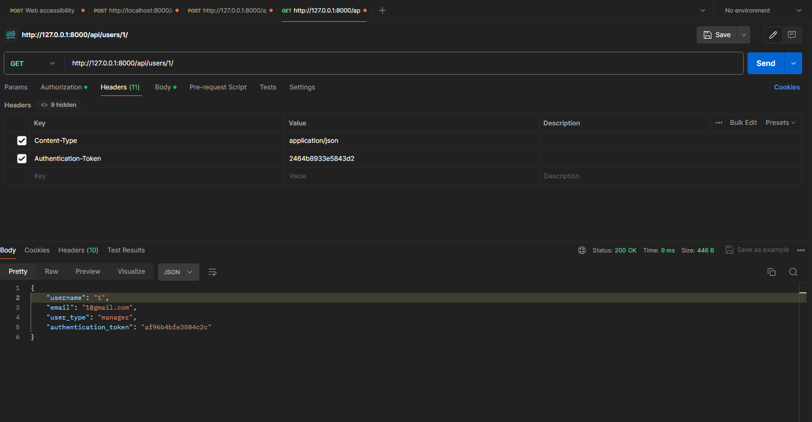

# Django REST API with Custom User Management

This Django project implements a RESTful API using Django Rest Framework (DRF) for user management. It includes user CRUD operations with permissions based on user types (manager and customer), token-based authentication, and custom middleware for logging requests and checking user types.

## Requirements

- Python 3.8+
- Docker

## Installation

1. Clone the repository:

   ```shell
   git clone https://github.com/Anisujjaman-Md/bitmorpher.git

   ```

2. Navigate to the project directory:

   ```shell
   cd config # for Linux/Mac

   ```

#### Docker

- Build and run the Docker containers:

  The API will be accessible at http://localhost:8000

  ```shell
   docker-compose up
  ```

#### Local

- Create a virtual environment and activate it:

  ```shell
  python3 -m venv venv
  source venv/bin/activate  # for Linux/Mac
  venv\Scripts\activate  # for Windows

  ```

- Install the dependencies:

  ```shell
  pip install -r requirements.txt

  ```

- Apply migrations:

  ```shell
  python manage.py migrate

  ```

- Start the development server:

  The API will be accessible at http://localhost:8000

  ```shell
   python manage.py runserver

  ```

## Usage

### API Endpoints

Users

- POST /API/users/: Create a new user (only managers).

Request body: {"username": "newuser", "email": "newuser@example.com", "password": "newpassword", "user_type": "customer"}

Response: {"username": "newuser", "email": "newuser@example.com", "user_type": "customer", "authentication_token": "generated_token"}

- GET /API/users/: List all users (only customers).

- GET /API/users/<username>/: Retrieve details of a specific user (only customers).

- PUT /API/users/<username>/: Update details of a specific user (only managers).

- DELETE /API/users/<username>/: Delete a specific user (only managers).

Authentication
Token-based authentication is used.
Managers can create, update, and delete users.
Customers can view user details and list users.

## Middleware

### Custom Middleware

RequestLogMiddleware: Logs details of each API request, including username and timestamp.

### UserTypeMiddleware

Checks the user's type based on the authentication token and grants permissions accordingly. Anonymous users are denied access.

### Api In postman Example


